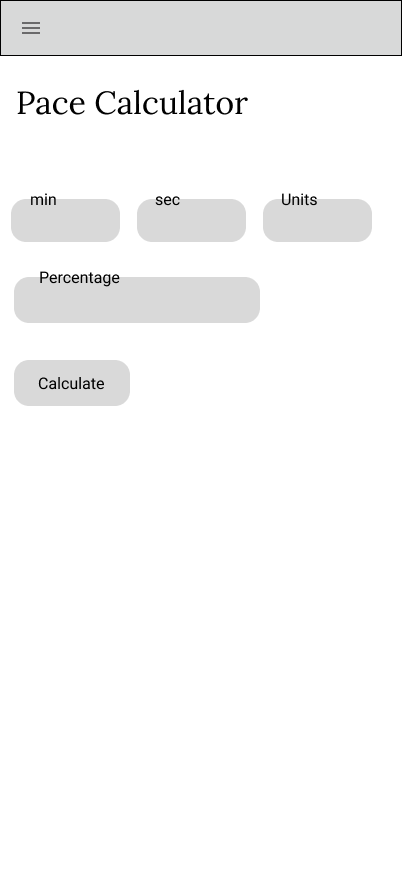
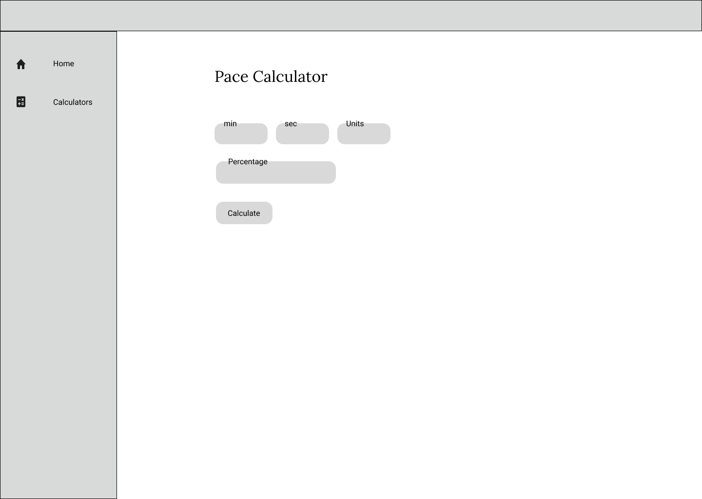

# Pace Calculator

The pace calculator allows a user to input a pace in either min/mi or min/km along with a percentage. The calculator then displays the pace that is the chosen percentage of the originally input pace.

The calculator uses Canova style calculations, meaning that a percentage such as 80% is calculated as 20% slower than the given pace. Likewise, 110% would be calculated as 10% faster than the given pace.

## Wireframes

Mobile

Desktop

Future enhancements:
- Allow for selecting multiple percentages at once